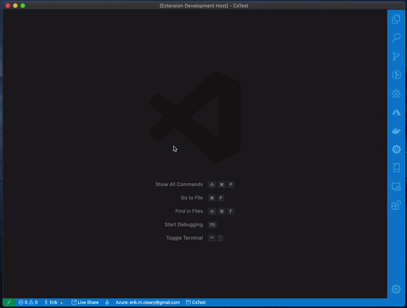

# dotnet scriptr

Execute C#/CSX files interactively in Visual Studio Code.

## Features

- Installs & integrates with `dotnet script` command, which is unaffiliated
    - Follow and support their progress [here](https://github.com/filipw/dotnet-script)!
- Create new C# Interactive workspaces
- Execute entire C# script files
- Execute selected or currently lines of C#
- Import nuget packages with `"#r nuget:..."` syntax

## Requirements

- .NET Core 3.0 or up

## Extension Settings

- **advanceNextLine**: If no text is selected, automatically advances to next line after executing 'Run Selection'.
    - Defaults to `false`

## Known Issues
There are known limitations within `dotnet script` which are outside of the scope of this extension. For issues relating to `dotnet script` submit issues [here](https://github.com/filipw/dotnet-script/issues)

- None

## Release Notes

### 0.0.1
Initial release providing basic integration with dotnet script
